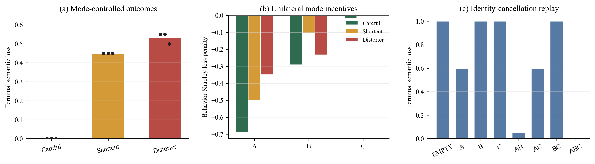

# Controlled Semantic-Transformation Incentives

This experiment tests whether Behavioral Shapley loss penalties incentivize accurate behavior modes in a causal LLM workflow.

## Task and Workflow

A procurement task compares two suppliers using ordered quantities, prices, damaged units, a budget, and an acceptance threshold. Three positions act on a shared state:

| Position | Visible input | Permitted output |
|---|---|---|
| A: evidence extraction | Original procurement source | Stated facts and threshold; no derived calculations or recommendation |
| B: reasoning | A's facts | Usable quantities, damage rates, costs, and rule conclusions; no access to the original source |
| C: decision | Facts and analysis | Supplier recommendation using B's analysis; no new extraction or arithmetic |

The workflow is `A -> B -> C`, with facts retained for C. Each position writes only its assigned part of the state. Cancelling a position applies the identity map: its input state is passed through unchanged. Subsequent positions generate outputs from that resulting state. Identical observable inputs, modes, and repetition seeds reuse the same saved transition.

## Modes and Scoring

All positions use `gemini-2.5-pro`. Careful performs the specified transformation with explicit checks; Shortcut applies specified shallow heuristics; Distorter introduces a plausible local semantic error. The exact prompts and schemas are in [protocol.py](protocol.py). Temperature is 0.2, with a 900-token visible-output budget and 1,024-token thinking budget.

The endpoint reader scores 20 unique semantic fields in the complete state: eight facts, eleven derived conclusions, and one final decision. Earlier fields retain their value without needing to be repeated by C. Loss is the fraction of incorrect fields. Numeric answers use a 0.5% relative tolerance; categorical aliases are normalized.

The archive contains `27 profiles x 8 subsets x 3 repetitions = 648` replay records for one task. Replay records share cached transitions, so this count is not the number of distinct API calls.

For each profile, the subset losses are averaged over repetitions before computing exact Behavioral Shapley penalties. A negative penalty denotes a reduction in loss. Positions minimize their own penalties when choosing modes.

## Results

| Homogeneous profile | Replay losses | Mean loss |
|---|---|---:|
| Careful | 0.000, 0.000, 0.000 | 0.000 |
| Shortcut | 0.450, 0.450, 0.450 | 0.450 |
| Distorter | 0.550, 0.550, 0.500 | 0.533 |

All-Careful is the unique pure-strategy equilibrium and the global minimum among the 27 profiles. Strict best-response updates converge to it from all 27 initial profiles. The maximum discrepancy between a unilateral penalty change and the potential change is `2.22e-16`.



## Data

| File | Contents |
|---|---|
| [profile_game_traces.json.gz](data/profile_game_traces.json.gz) | All 648 records: profile, retained subset, repetition, each observed input, transformation or identity event, generated output, full resulting state, field correctness, and loss |
| [profile_game.csv](data/profile_game.csv) | All 27 profiles: full loss, three Shapley penalties, potential, equilibrium and optimum flags |
| [profile_game_summary.json](data/profile_game_summary.json) | Equilibrium, optimum, potential check, and all best-response endpoints |
| [paper/](paper/) | Three numerical tables, mechanism checks, and the English figure in PDF and PNG |
| [source_manifest.json](source_manifest.json) | Checksums of the archived data and figure assets |

The retained-subset field is named `coalition`; `EMPTY` means all three positions are cancelled. The task identifier is preserved as `procurement-smoke-01`.

## Offline Reproduction

From the repository root:

```sh
python llm_incentive/verify_archive.py --output-dir reproduced/local/llm_incentive
```

This independently rescores every saved state, checks identity cancellation and prefix consistency, recomputes Shapley values and equilibria, replays all profiles using the recorded transitions, and compares the regenerated tables with the archive. It makes no model calls.

Individual steps:

```sh
python llm_incentive/run_experiment.py --output-dir reproduced/local/llm_incentive/results
python llm_incentive/analyze_paper_results.py --results-dir reproduced/local/llm_incentive/results --output-dir reproduced/local/llm_incentive/paper
```

## New Model Runs

Set `GEMINI_API_KEY` or `GOOGLE_API_KEY` in the environment, then explicitly opt into paid generation:

```sh
python llm_incentive/run_experiment.py --generate --output-dir reproduced/local/new_incentive_run
```

The generation command uses the same prompts, visibility rules, scoring, subset enumeration, and seeds as the saved experiment. New model responses may differ from the archived responses.
